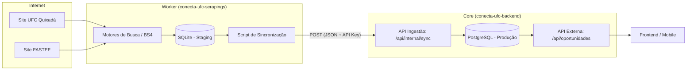
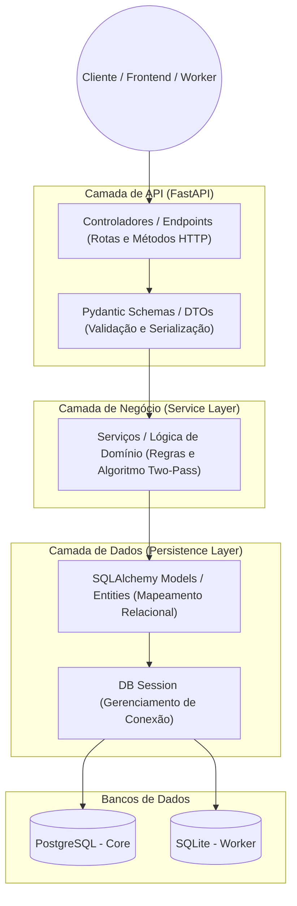
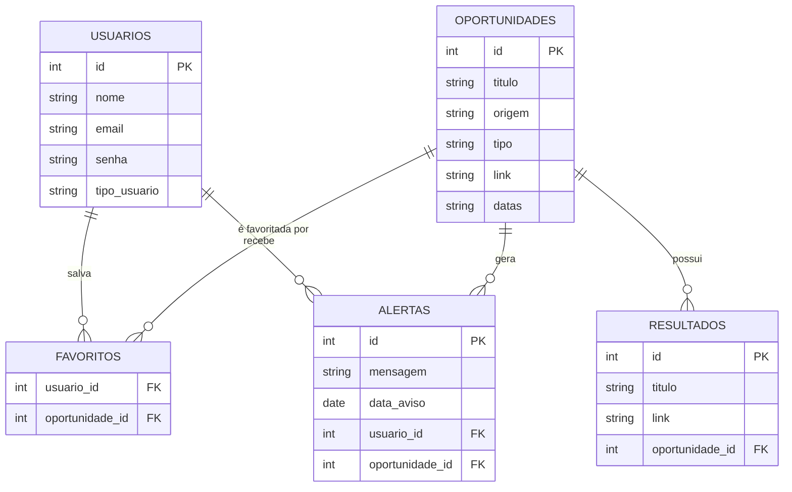
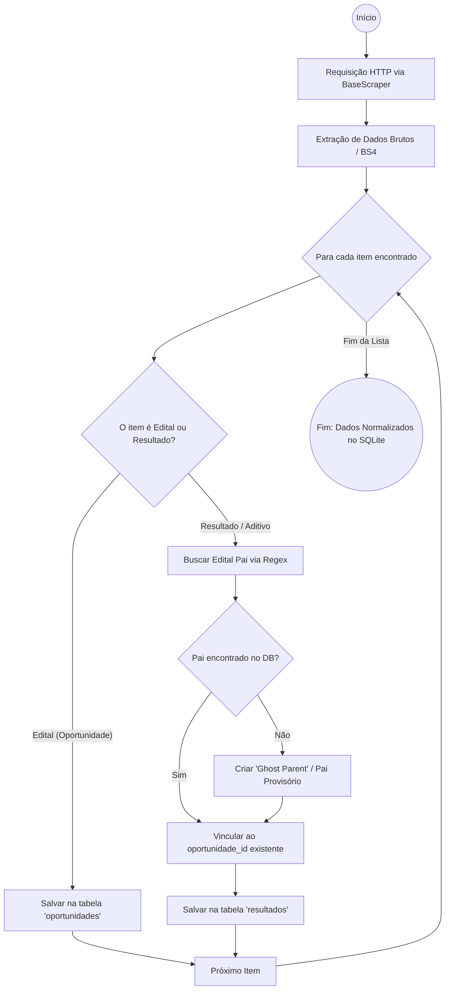
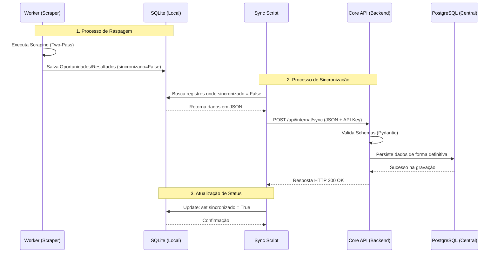

# Conecta-UFC: Documentação de Arquitetura e Contexto

## 1. Visão Geral do Projeto
O **Conecta-UFC** é um sistema projetado para centralizar, monitorar e disponibilizar oportunidades acadêmicas e profissionais (bolsas, projetos de extensão, processos seletivos) e seus respectivos resultados. O sistema raspa (scrape) dados de diferentes fontes institucionais, normaliza essas informações e as expõe via API para consumo de front-ends (Web/Mobile).

Atualmente, o sistema extrai dados de duas fontes principais:
1. **UFC (Campus Quixadá):** Editais agrupados em blocos sanfona.
2. **FASTEF (Fundação de Apoio):** Editais e Resultados publicados como "cartões" (cards) independentes num grid dinâmico.

---

## 2. Stack Tecnológico Principal
- **Linguagem:** Python 3.12 (Gerenciamento de dependências com `uv`)
- **API Web:** FastAPI + Uvicorn
- **Banco de Dados (ORM):** SQLAlchemy + Alembic (Migrações)
- **Bancos de Dados Físicos:** SQLite (Local/Worker) e PostgreSQL (Alvo de Produção/Backend)
- **Validação e Serialização:** Pydantic
- **Web Scraping:** BeautifulSoup4 (bs4), Regex, Requests/HTTPX nativo.
- **Agendamento (Planejado):** APScheduler
- **Infraestrutura (Planejada):** Docker e Docker Compose

---

## 3. Estado Atual: O que já está construído e validado

Até o momento, o sistema funcionou como um "monolito de prototipação" no diretório `conecta-ufc-scrapings` para validar as regras de negócio e a extração. O núcleo funcional possui:

### 3.1. Modelagem de Dados (Relacional)
O banco foi modelado com uma relação **1:N** estrita:
- Tabela `oportunidades` (Pai): Guarda o Edital principal (id, titulo, origem, tipo, link, datas).
- Tabela `resultados` (Filho): Guarda aditivos e resultados (id, titulo, link, oportunidade_id).
- **Alembic:** Configurado profissionalmente com `naming_convention` e `render_as_batch=True` para contornar as limitações de `ALTER TABLE` do SQLite.

### 3.2. Os Motores de Busca (Scrapers)
- **`BaseScraper`:** Classe abstrata com resiliência de rede (ignora erros SSL, usa headers de navegadores reais para evitar bloqueios).
- **`UfcScraper`:** Extrai dados de listas aninhadas em HTML (`<ul>`, `<li>`), vinculando links de editais a links de resultados pela proximidade no DOM.
- **`FastefScraper`:** O raspador mais complexo. Como a FASTEF publica "Resultados" como postagens isoladas dos seus "Editais", foi implementado um **Algoritmo Two-Pass (Duas Passadas)**:
  1. *Primeira Passada:* Salva todos os Editais Principais.
  2. *Segunda Passada:* Processa os Resultados e vincula via Regex (`Edital 01/2026`) aos seus pais.
  - **Padrão Ghost Parent (Pai Provisório):** Se o scraper encontra um "Resultado" mas o "Edital Pai" não está mais na página web, o algoritmo cria um "Edital Pai Provisório" no banco de dados. Isso garante a integridade referencial 1:N sem perder dados.

### 3.3. A Camada de API (Endpoints Ativos)
- `POST /api/scrapers/ufc/run` e `/fastef/run`: Gatilhos manuais que executam a raspagem e lidam com duplicidades (`set()` em memória e checagens no DB).
- `GET /api/oportunidades/`: Retorna editais paginados com schemas aninhados usando Pydantic (um edital traz todos os seus resultados dentro dele, carregados eficientemente via `joinedload` do SQLAlchemy).
- `GET /api/resultados/`: Rota independente para consumo ágil de "Últimas Atualizações".

---

## 4. A Arquitetura Alvo: Microserviços e Distribuição

Estamos em transição do protótipo para uma arquitetura distribuída usando o padrão **Store and Forward (Armazenar e Encaminhar)**. O repositório foi dividido em duas pastas principais:

### 4.1. O Worker: `conecta-ufc-scrapings`
- **Função:** "Cão Farejador" assíncrono.
- **Banco de Dados:** SQLite (isolado, atua como *Staging Area*).
- **Comportamento:** Irá rodar sozinho, raspar a web, usar a lógica "Two-Pass/Ghost Parent" para montar objetos válidos no SQLite.
- **Sincronização:** Possuirá uma flag `sincronizado_backend = False`. Um script tentará fazer `POST` do JSON bruto com os novos achados para a API Central. Em caso de sucesso (HTTP 200), a flag muda para `True`.

### 4.2. O Core: `conecta-ufc-backend`
- **Função:** O cérebro central e "Cofre" da aplicação.
- **Banco de Dados:** PostgreSQL (robusto, pronto para concorrência).
- **Segurança:** Terá uma rota de ingestão (`POST /api/internal/sync`) protegida por chave de API. Recebe dados do Worker, higieniza contra vulnerabilidades (XSS, SQLi via Pydantic) e insere no Postgres.
- **API Externa:** Servirá o Frontend de forma rápida e com filtros de busca avançados.

---

## 5. Próximos Passos (Backlog Atual)

Para concluir a migração arquitetural e deixar o sistema em nível de produção (Deploy Ready), os próximos passos são (nesta ordem recomendada):

1. **Configuração do Backend Central:**
   - Transportar a estrutura do banco (Models/Alembic) do `scrapings` para o `conecta-ufc-backend`.
   - Configurar a string de conexão para PostgreSQL.
   - Criar a rota protegida de ingestão de dados (`/api/internal/sync`).

2. **Refatoração do Worker (Scrapings):**
   - Criar migração no SQLite para adicionar a coluna `sincronizado_backend`.
   - Criar o script/task que envia os dados pendentes para o Backend via requisição HTTP (`httpx` ou `requests`).
   - Instalar e configurar o `APScheduler` para rodar os scrapers automaticamente a cada X horas.

3. **Infraestrutura:**
   - Escrever o `Dockerfile` para as aplicações.
   - Escrever o `docker-compose.yml` unindo: Banco PostgreSQL, Backend Service e Scraper Worker Service.

4. **Features de API:**
   - Adicionar Query Parameters (filtros por origem, tipo e buscas por título) no endpoint principal de `oportunidades`.
---

## 6. Arquitetura e Diagramas (Detalhamento Técnico)

### 6.1. Arquitetura de Alto Nível (Distribuição de Serviços)
A solução adota o padrão **Store and Forward** (Armazenar e Encaminhar), separando a coleta de dados da sua exposição pública.

**Explicação:** O **Worker** atua de forma autônoma, raspando os sites e salvando os achados no **SQLite** local. Um script de sincronização posterior envia esses dados via `POST` para o **Core Backend**, que os persiste definitivamente no **PostgreSQL**. Isso garante que, se o site da UFC estiver instável, o Worker não interrompe o funcionamento do Backend central.

---

### 3.2. Padrão de Projeto: Camadas Internas
O Backend segue a separação estrita entre controladores e entidades, garantindo que a lógica de negócio não seja acoplada diretamente à interface de rede ou ao banco de dados.

---

### 3.3. Modelo de Domínio e Persistência (DER)
O banco de dados foi modelado para suportar a relação de um Edital para múltiplos Resultados e Aditivos.

**Explicação:** A tabela `oportunidades` armazena o edital principal. A tabela `resultados` está vinculada a ela via chave estrangeira, permitindo que cada oportunidade exiba seu histórico completo de atualizações.

---

### 3.4. Fluxograma do Algoritmo de Scraping (Diferencial Técnico)
Para lidar com a desorganização das fontes externas (especialmente na FASTEF), foi implementado um **Algoritmo de Duas Passadas**.

**Solução Inovadora:** O uso do padrão **Ghost Parent** resolve o problema de integridade referencial quando um resultado é publicado, mas o edital original já foi removido do site de origem. O sistema cria um "Pai Provisório" para garantir que o resultado não seja perdido.

---

### 3.5. Ciclo de Vida da Sincronização (Diagrama de Sequência)
Este diagrama detalha a comunicação temporal entre o Worker e a API central.

---

## 4. Segurança e Integridade
* **Ingestão Protegida:** A rota `/api/internal/sync` é protegida por uma chave de API para evitar inserções de dados por terceiros não autorizados.
* **Flag de Sincronização:** O uso da coluna `sincronizado_backend` no SQLite garante que, em caso de queda de internet, o Worker reenvie apenas os dados pendentes no próximo ciclo.

---

## 5. Próximos Passos (Backlog)
1.  Migração completa dos modelos para o ambiente de produção PostgreSQL.
2.  Implementação do `APScheduler` para automatização dos ciclos de busca.
3.  Conteinerização de toda a stack utilizando Docker e Docker Compose.
