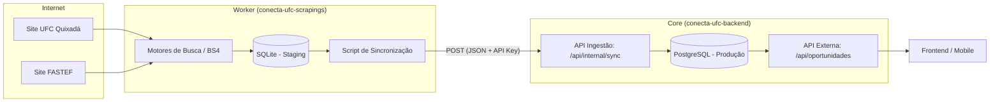
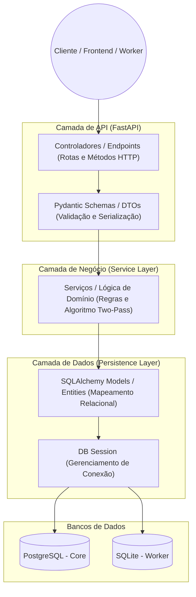
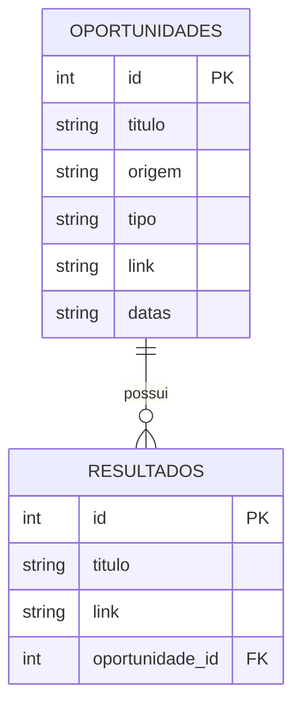
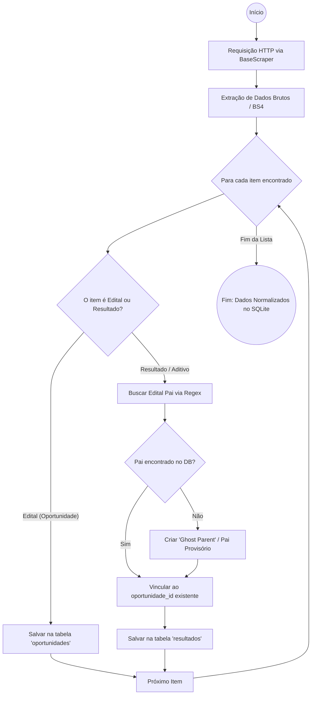
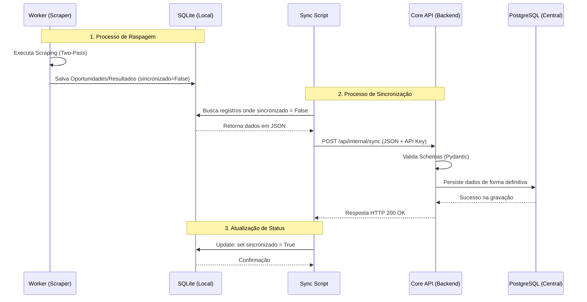

# Documentação de Arquitetura: Projeto Conecta-UFC

## 1. Visão Geral do Projeto
O **Conecta-UFC** é um sistema distribuído projetado para centralizar, monitorar e disponibilizar oportunidades acadêmicas e profissionais (bolsas, projetos de extensão, processos seletivos) da Universidade Federal do Ceará. O sistema utiliza técnicas de *web scraping* para extrair dados de fontes institucionais como o Campus Quixadá e a FASTEF, normalizando essas informações para consumo via API por interfaces Web e Mobile.

---

## 2. Motivações e Escolhas Tecnológicas
A *stack* tecnológica foi selecionada com foco em performance, escalabilidade e robustez no tratamento de dados externos.

* **Linguagem Python 3.12:** Escolhida por sua maturidade em processamento de dados e vasta biblioteca para *scraping* (BeautifulSoup4) e APIs web.
* **FastAPI:** Framework moderno de alta performance que utiliza programação assíncrona, essencial para lidar com múltiplas requisições de entrada de dados e consultas externas.
* **Pydantic:** Utilizado para garantir a integridade dos dados através de validação rigorosa e tipagem, protegendo o sistema contra vulnerabilidades como *XSS* e garantindo contratos de API consistentes.
* **SQLAlchemy & Alembic:** O ORM SQLAlchemy permite uma manipulação de dados independente do banco de dados físico, enquanto o Alembic gerencia migrações de esquema de forma versionada e segura.
* **PostgreSQL (Core):** Escolhido para o servidor central pela sua capacidade de lidar com alta concorrência e integridade referencial complexa em produção.
* **SQLite (Worker):** Utilizado localmente no Worker como uma *Staging Area* (área de triagem). Sua simplicidade permite que o Worker opere de forma isolada e resiliente a falhas de rede.

---

## 3. Arquitetura e Diagramas

### 3.1. Arquitetura de Alto Nível (Distribuição de Serviços)
A solução adota o padrão **Store and Forward** (Armazenar e Encaminhar), separando a coleta de dados da sua exposição pública.

**Explicação:** O **Worker** atua de forma autônoma, raspando os sites e salvando os achados no **SQLite** local. Um script de sincronização posterior envia esses dados via `POST` para o **Core Backend**, que os persiste definitivamente no **PostgreSQL**. Isso garante que, se o site da UFC estiver instável, o Worker não interrompe o funcionamento do Backend central.

---

### 3.2. Padrão de Projeto: Camadas Internas
O Backend segue a separação estrita entre controladores e entidades, garantindo que a lógica de negócio não seja acoplada diretamente à interface de rede ou ao banco de dados.

---

### 3.3. Modelo de Domínio e Persistência (DER)
O banco de dados foi modelado para suportar a relação de um Edital para múltiplos Resultados e Aditivos.

**Explicação:** A tabela `oportunidades` armazena o edital principal. A tabela `resultados` está vinculada a ela via chave estrangeira, permitindo que cada oportunidade exiba seu histórico completo de atualizações.

---

### 3.4. Fluxograma do Algoritmo de Scraping (Diferencial Técnico)
Para lidar com a desorganização das fontes externas (especialmente na FASTEF), foi implementado um **Algoritmo de Duas Passadas**.

**Solução Inovadora:** O uso do padrão **Ghost Parent** resolve o problema de integridade referencial quando um resultado é publicado, mas o edital original já foi removido do site de origem. O sistema cria um "Pai Provisório" para garantir que o resultado não seja perdido.

---

### 3.5. Ciclo de Vida da Sincronização (Diagrama de Sequência)
Este diagrama detalha a comunicação temporal entre o Worker e a API central.

---

## 4. Segurança e Integridade
* **Ingestão Protegida:** A rota `/api/internal/sync` é protegida por uma chave de API para evitar inserções de dados por terceiros não autorizados.
* **Flag de Sincronização:** O uso da coluna `sincronizado_backend` no SQLite garante que, em caso de queda de internet, o Worker reenvie apenas os dados pendentes no próximo ciclo.

---

## 5. Próximos Passos (Backlog)
1.  Migração completa dos modelos para o ambiente de produção PostgreSQL.
2.  Implementação do `APScheduler` para automatização dos ciclos de busca.
3.  Conteinerização de toda a stack utilizando Docker e Docker Compose.